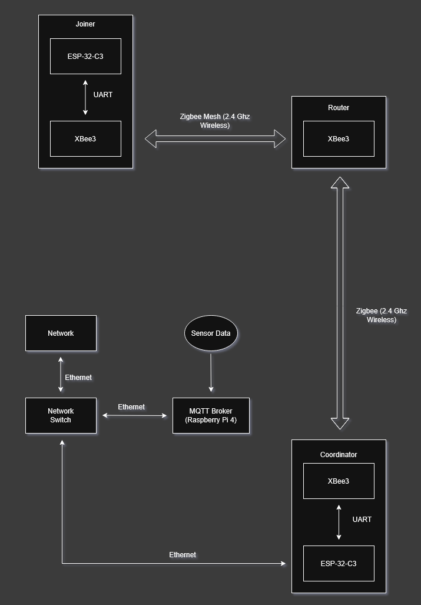

# zigbee-smart-switch

A Zigbee-based smart switch system for remote dehumidifier control, built for Industry 4.0 reliability, connectivity, and remote management.

## Purpose
- Build a smart switch to control a system of dehumidifiers remotely
- Integrate IoT connection through Mosquitto

### High-Level System Diagram



## Frameworks & Software

| Tool | Purpose |
|---|---|
| [Digi XCTU](https://www.digi.com/products/embedded-systems/digi-xbee/digi-xbee-tools/xctu) | Programs XBee modules |
| [PlatformIO](https://platformio.org/) | Build system and library manager for all firmware |
| [Mosquitto](https://github.com/eclipse-mosquitto/mosquitto) | MQTT broker |

## Firmware

Firmware is written in C using the ESP-IDF framework with FreeRTOS, built and flashed via VS Code with the PlatformIO extension.

### Setup

1. Install [VS Code](https://code.visualstudio.com/) and the [PlatformIO extension](https://platformio.org/install/ide?install=vscode)
2. Open `coord_esp32-c3/` or `join_esp32-c3/` as the workspace root in VS Code
3. PlatformIO will auto-detect the target from `platformio.ini`
4. Build and flash via the PlatformIO toolbar, or `pio run -t upload`

### Programming the XBee Modules

> **Note:** You **must** use the XBee Grove Development Board and XCTU to program the XBee modules. Plug in with USB micro-B and add device to XCTU.

| | Coordinator | Joiner | Router |
| --- | --- | --- | --- |
| **CE** Device Role | Form Network [1] | Join Network [0] | Join Network [0] |
| **ID** Extended PAN ID | 1234 | 1234 | 1234 |
| **JV** Coordinator Verification | Enabled [1] | Disabled [0] | Disabled [0] |
| **JN** Join Notification | Disabled [0] | Enabled [1] | Enabled [1] |
| **NI** Node Identifier | SS_Comm | SS_x (0...) | RT_x (0...) |
| **BD** UART Baud Rate | 115200 | 115200 | 115200 |
| **AP** API Enable | API Mode Without Escapes [1] | API Mode Without Escapes [1] | API Mode Without Escapes [1] |
| **SM** Sleep Mode | No Sleep [0] | No Sleep [0] | No Sleep [0] |
| **EE** Encryption Enable | Disabled [0] | Disabled [0] | Disabled [0] |

### Firmware Structure

#### Coordinator (`firmware/coord_esp32-c3/`)
```
config.h
xbee.h/.c       — raw API frame TX/RX, AT commands, ping, RX task
discovery.h/.c  — ND-based dynamic node table
relay.h/.c      — command routing
button.h/.c     — physical button, triggers toggle to all nodes
ethernet.h/.c   — W5500 SPI ethernet, DHCP
mqtt.h/.c       — MQTT client, command handler (switch/+/cmd), state publisher
main.c
```

#### Joiner (`firmware/joiner_esp32-c3/`)
```
config.h
xbee.h/.c       — raw API frame TX/RX, state reporting
relay.h/.c      — relay GPIO control
button.h/.c     — manual override, reports state to coordinator
main.c
```

### Key Technical Notes

- All XBee communication uses manually constructed raw API frames
- Frame types used: `0x10` ZBTxRequest, `0x08` AT command, `0x88` AT response, `0x90` ZB RX, `0x8B` TX status

## Hardware

### Coordinator
- ESP32-C3 Super Mini + XBee3 Zigbee 3.0 TH + W5500 Ethernet

### Joiner
- ESP32-C3 Super Mini + XBee3 Zigbee 3.0 TH

## Raspberry Pi Broker Setup

The Pi runs a Mosquitto MQTT broker and connects directly to the coordinator via ethernet.

### Mosquitto
```bash
sudo apt update && sudo apt install -y mosquitto mosquitto-clients
sudo systemctl enable mosquitto
printf 'listener 1883\nallow_anonymous true\n' | sudo tee /etc/mosquitto/conf.d/local.conf
sudo systemctl restart mosquitto
```

### Broker Connection

The coordinator connects to the broker at a hardcoded hostname in `mqtt.c`:

```c
.broker.address.uri = "mqtt://rpi3.local:1883"
```

> **Production note:** This hostname is compiled into the firmware. If the broker host changes (different Pi, renamed host, or production deployment), update the URI in `mqtt.c` and reflash the coordinator. A `.local` hostname requires mDNS resolution to be enabled in the firmware (`CONFIG_LWIP_DNS_SUPPORT_MDNS_QUERIES=y`); if mDNS resolution is unreliable on the network, substitute the broker's IP address directly. A future revision could replace this with mDNS service discovery (`_mqtt._tcp`) to remove the hardcoded dependency entirely.

### MQTT Topics
| Topic | Direction | Description |
|-------|-----------|-------------|
| `switch/all/cmd` | Pi → Coordinator | Command all nodes |
| `switch/SS_<n>/cmd` | Pi → Coordinator | Command individual node |
| `switch/SS_<n>/state` | Coordinator → Pi | Per-node joiner state report |

Supported commands: `ON`, `OFF`, `TOGGLE`, `POLL`

### Examples
```bash
# All nodes on / off
mosquitto_pub -h localhost -t "switch/all/cmd" -m "ON"
mosquitto_pub -h localhost -t "switch/all/cmd" -m "OFF"

# Individual node
mosquitto_pub -h localhost -t "switch/SS_0/cmd" -m "ON"
mosquitto_pub -h localhost -t "switch/SS_1/cmd" -m "TOGGLE"

# Poll without changing state
mosquitto_pub -h localhost -t "switch/SS_1/cmd" -m "POLL"
mosquitto_pub -h localhost -t "switch/SS_0/cmd" -m "POLL"

# Subscribe to all state updates
mosquitto_sub -h localhost -t "switch/+/state" -v
```

## References
- [Digi XBee 3](https://hub.digi.com/support/products/digi-xbee/digi-xbee3/)
- [Digi XBee API Frame Reference](https://docs.digi.com/resources/documentation/digidocs/rf-docs/blu/blu-api-frames_c.html)
- [XBee Grove Development Board User Guide](https://docs.digi.com/resources/documentation/digidocs/pdfs/90001457-13.pdf)
- [ESP-IDF Programming Guide](https://docs.espressif.com/projects/esp-idf/en/latest/)
- [Digi XBee Python Library (not used, but helpful)](https://xbplib.readthedocs.io/en/latest/index.html)